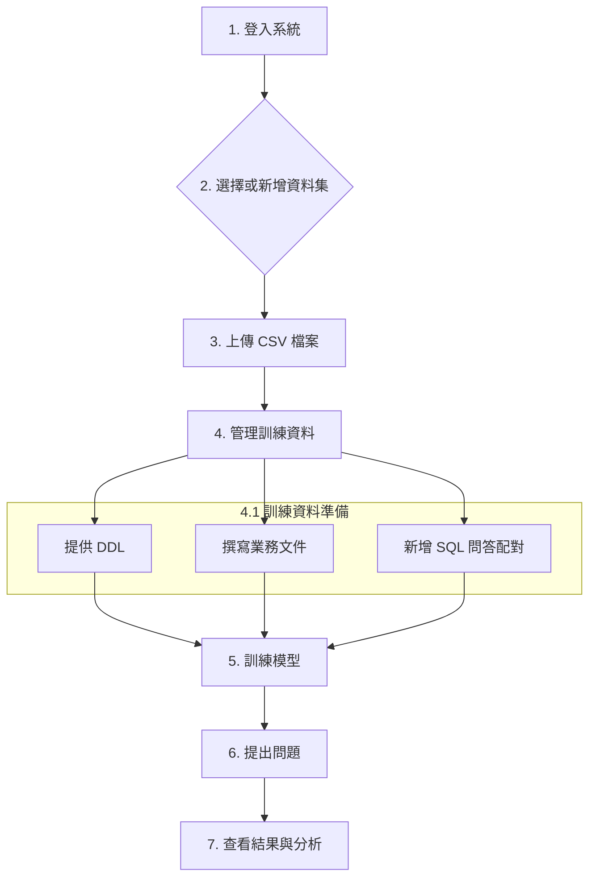
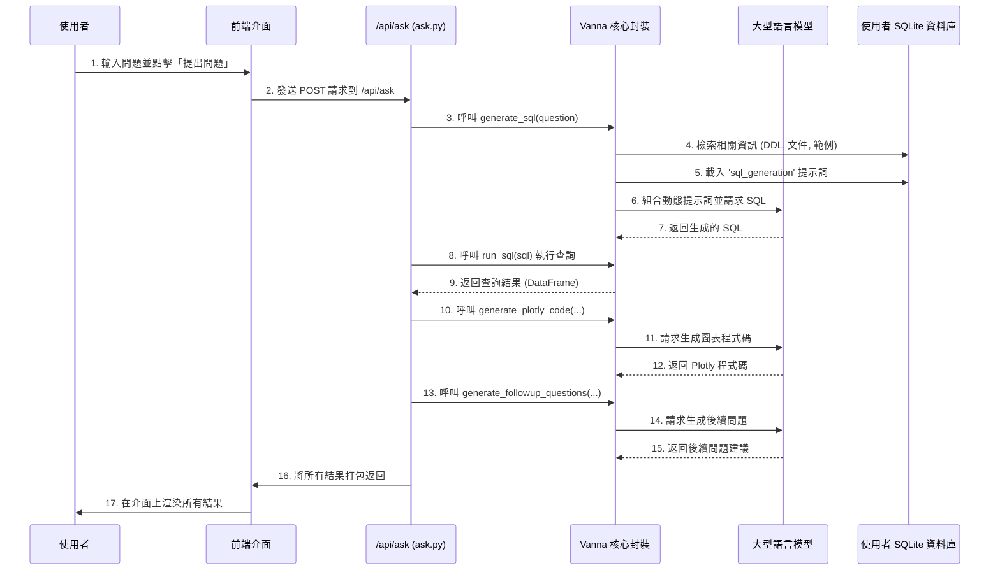
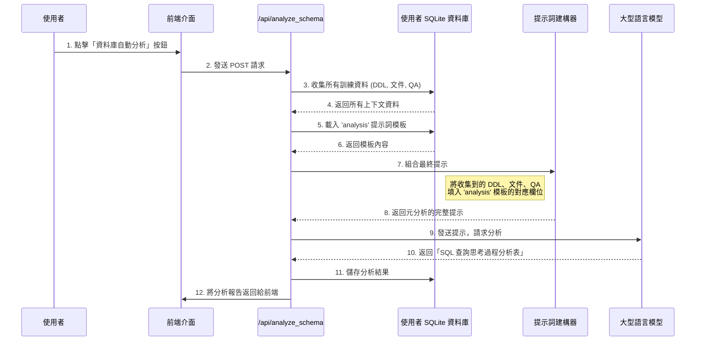
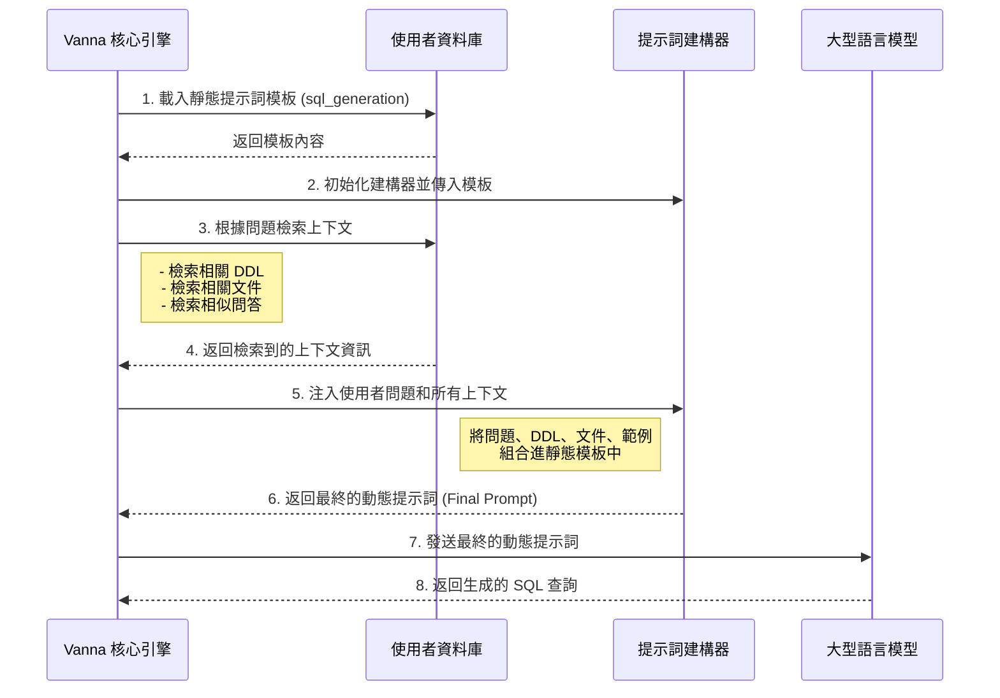

# DB-GPT-WEBUI

這是一個基於 Vanna.ai 和 Flask 的網頁應用程式，旨在提供一個圖形化介面，讓使用者可以透過自然語言與資料庫進行互動。使用者可以上傳自己的資料集、訓練 AI 模型，並透過提問來查詢資料。

## 功能特色

- **多使用者支援**：每個使用者擁有獨立的訓練資料和資料集。
- **圖形化訓練介面**：透過網頁介面輕鬆管理 DDL、業務文件和 SQL 問答配對。
- **動態日誌分析**：在每次提問後，系統會自動收集所有檢索過程的日誌，並發送給大型語言模型 (LLM) 進行分析，以提供更深入的洞察。
- **提示詞歷史紀錄**：自動保存每一次發送給 LLM 的完整提示詞，方便使用者進行分析和優化。
- **分塊處理**：自動將過長的提示詞分塊，以避免超出 LLM 的處理上限。
- **密碼哈希認證**：採用安全的密碼哈希機制儲存使用者憑證，提升系統安全性。

## 快速上手流程



## 安裝與啟動

### 1. 環境準備

在開始之前，請確保您已經安裝了 Python 3.8 或更高版本。接著，執行以下步驟：

- **安裝依賴套件**:
  ```bash
  pip install -r requirements.txt
  ```

- **設定環境變數**:
  複製 `.env.example` 檔案為 `.env`，然後編輯 `.env` 檔案。
  ```bash
  cp .env.example .env
  ```
  您需要**選擇一種** LLM 供應商並填入對應的設定。程式會自動偵測您啟用的設定。

  - **範例：使用本地端的 Ollama**
    ```
    # --- LLM Configuration ---
    OLLAMA_HOST=http://your-ollama-server-ip:11434
    OLLAMA_MODEL=your-model-name:latest
    ```
  - **範例：使用 OpenAI**
    ```
    # --- LLM Configuration ---
    OPENAI_API_KEY="sk-..."
    OPENAI_MODEL="gpt-4-turbo"
    ```
  **重要**：請確保一次只啟用一種 LLM 的設定，將其他供應商的設定保持註解狀態。

### 2. 啟動應用程式

完成環境準備後，執行以下指令來啟動 Flask 網頁應用程式：

```bash
python app.py
```

應用程式預設會在 `0.0.0.0:5001` 上執行。您可以在瀏覽器中開啟 `http://localhost:5001` 來存取網頁介面。

## 網頁介面使用方法

### 1. 登入

請使用您在 `.env` 檔案中透過 `APP_USERS` 變數設定的帳號和密碼進行登入。

**密碼哈希認證**：系統支援使用明文密碼或哈希後的密碼。建議在正式環境中使用哈希密碼以增強安全性。哈希密碼可透過專用工具生成。

### 2. 新增與選擇資料集

- **新增資料集**：點擊右上角的「+ 新增」按鈕。在彈出的視窗中，為您的資料集命名，並選擇一個或多個要上傳的 CSV 檔案。系統會為每個 CSV 檔案在資料庫中建立一個對應的資料表。
- **選擇資料集**：從下拉式選單中選擇您想要操作的資料集。選擇後，下方的訓練介面將會被啟用。

### 3. 管理訓練資料

選擇資料集後，您可以開始管理該資料集的訓練資料。

- **選擇資料表**：您可以選擇針對「全局/跨資料表」或某個特定的資料表 (CSV) 來進行訓練。
- **Schema (DDL)**：當您選擇一個資料表時，其 DDL (資料表定義語言) 會自動顯示在此處。選擇「全局」則會顯示所有資料表的 DDL。
- **知識背景文件**：在此處輸入與所選資料表或整個資料集相關的業務知識、欄位定義、常用縮寫等。您也可以透過檔案上傳的方式來新增。完成後，請點擊「儲存文件」。
- **SQL 問答配對**：在此處新增「問題」（自然語言）與其對應「SQL 語法」的配對。這是訓練模型理解如何將問題轉換為 SQL 的關鍵。您可以手動新增，也可以透過上傳 `.sql` 檔案來批次生成。

### 4. 訓練模型

當您準備好 DDL、文件和問答配對後，點擊「重新訓練整個模型」按鈕。系統會將這些資料向量化並儲存起來，用於後續的提問。

訓練過程中，系統會自動處理並優化數據，包括:
- 對訓練資料進行向量化處理
- 建立索引以加速後續查詢
- 生成優化後的訓練模型儲存至本地

訓練完成後，頁面會顯示訓練成功的提示，此時您可以開始使用模型進行查詢。

### 5. 提出問題

模型訓練完成後，「提出問題」區塊將會啟用。在輸入框中用自然語言輸入您的問題後，系統會執行以下核心流程：



最終，前端介面會將以下結果呈現給使用者：
- **生成的 SQL**：顯示最終由 AI 生成的可執行 SQL 語法。
- **查詢結果**：以表格形式顯示 SQL 查詢的結果。
- **視覺化圖表**：如果適用，將會顯示一個由 Plotly 生成的互動式圖表。
- **SQL 查詢解釋**：提供對生成 SQL 的自然語言解釋。

### 6. 資料庫自動分析流程

此功能旨在對使用者提供的**所有訓練材料**（DDL、文件、QA）進行一次全面的**元分析（Meta-Analysis）**，生成一份關於「如何查詢這個資料庫」的思考過程總結。



### 7. 測試模型功能

您可以透過以下方式測試模型的性能和準確性：

- **批量測試**：透過上傳包含多個測試問題的文件，系統可以自動批量處理這些問題並生成相應的 SQL 查詢，方便您評估模型在不同場景下的表現。
- **結果驗證**：生成的 SQL 查詢可以直接在介面上查看和複製，您可以將其導出至外部工具或直接在系統中進行簡單驗證。
- **反饋機制**：您可以對生成的 SQL 查詢結果提供反饋，幫助模型不斷改進。若發現生成的 SQL 有誤，您可以在界面上直接修改並保存為新的訓練數據。

### 8. 查看提示詞歷史紀錄

每一次您提出問題時，系統發送給 LLM 進行分析的完整提示詞，都會被自動保存到專案根目錄下的 `prompt_history` 資料夾中。您可以隨時查看這些 `.txt` 檔案，以了解 AI 的「思考過程」，並根據這些資訊來優化您的訓練資料或提示詞範本 (`prompts/ask_analysis_prompt.txt`)。

## 9. 自動化測試功能

系統提供了自動化測試腳本，用於評估模型在生成 SQL 查詢方面的性能和準確性。

### 8.1 執行測試

您可以透過以下指令來執行自動化測試：

```bash
python test_sql_qa_success_rate.py
```

測試腳本將自動使用指定的資料集和訓練數據，對模型進行批量提問測試，並生成詳細的測試報告。

### 8.2 測試結果分析

測試完成後，您可以在 `test_logs` 目錄中找到測試報告，包括：

- **成功/失敗案例統計**：顯示測試的成功率和具體的成功/失敗案例數量
- **成功率報告**：提供整體成功率指標
- **詳細問答記錄**：記錄每個問題和相應生成的 SQL 查詢

這些報告可以幫助您識別模型的優勢和不足，並針對性地改進訓練數據。

## 系統架構

### 主要模組

1. **核心服務**
   - Flask Web 框架：提供網頁介面和 API 服務
   - Vanna.ai：處理自然語言到 SQL 的轉換和模型訓練

2. **數據存儲**
   - SQLite 資料庫：存儲使用者數據、訓練資料和配置信息
   - 本地文件系統：保存訓練數據、提示詞歷史和測試結果

3. **安全模組**
   - 使用者認證：透過密碼哈希機制保障使用者帳號安全
   - 數據隔離：不同使用者的數據完全隔離，確保數據安全

### 工作流程

1. **數據準備階段**：使用者上傳 CSV 數據，添加 DDL、業務文件和 SQL 問答配對
2. **模型訓練階段**：系統將訓練數據向量化，建立索引並生成模型
3. **查詢階段**：使用者提出問題，系統生成 SQL 查詢並呈現結果
4. **分析與改進階段**：透過查看提示詞歷史和測試報告，優化訓練數據和模型

## 注意事項

1. **資料集管理**
   - 資料集 ID 目前採用數字形式（如 "1"）進行標識，請確保在使用 API 或配置文件時使用正確的 ID 格式
   - 建議為不同的數據分析場景建立單獨的資料集，以提高查詢準確率

2. **模型性能**
   - 模型的準確性高度依賴於訓練數據的質量和數量，建議提供充足且多樣的 SQL 問答配對
   - 定期更新訓練數據，以適應業務變化和提高模型準確性
   - 使用測試功能定期評估模型性能，及時發現和解決問題

3. **安全考量**
   - 在正式環境中，請務必使用密碼哈希而非明文密碼
   - 定期備份重要的訓練數據和配置文件
   - 限制對敏感數據的訪問權限

4. **故障排除**
   - 如果遇到「Active dataset not found」或類似錯誤，請檢查資料集 ID 是否正確設置（目前需使用數字形式，如 "1"）
   - 若訓練或查詢過程中出現異常，請查看應用程式日誌以獲取詳細資訊
   - 如遇到數據加載問題，請確保資料庫表結構符合要求：
     - `training_ddl` 表需要包含 `ddl_statement` 列
     - `training_documentation` 表需要包含 `documentation_text` 列
     - `training_qa` 表需要包含 `question` 和 `sql_query` 列
   - 若測試腳本執行後無輸出，請檢查 `test_logs` 目錄是否存在對應的日誌文件

## 動態提示詞核心架構

本系統的核心在於其**動態提示詞（Dynamic Prompt）**的構成機制。它並非使用固定不變的模板，而是在執行期間，由「靜態基礎模板」和「動態生成的上下文」組合而成，為每一個問題量身打造最適合的提示。

### 動態提示詞構成序列圖



### 圖表解說

1.  **載入靜態模板**：`Vanna 核心引擎` 首先從 `使用者資料庫` 中讀取基礎的 `sql_generation` 提示詞模板。
2.  **初始化建構器**：引擎使用這個靜態模板來初始化一個 `提示詞建構器`。
3.  **檢索動態上下文**：接著，引擎再次查詢 `使用者資料庫`，但這次是為了根據使用者的具體問題，檢索出所有相關的動態資訊（DDL、文件、相似問答等）。
4.  **注入與組合**：引擎將這些即時檢索到的動態上下文，連同使用者的原始問題，一同「注入」到 `提示詞建構器` 中。
5.  **生成最終提示**：`提示詞建構器` 將所有部分組合起來，生成一個專為此次查詢量身打造的、內容豐富的「最終動態提示詞」。
6.  **發送與生成**：這個最終的提示詞被發送給 `大型語言模型 (LLM)`，LLM 基於這些完整的資訊來生成精準的 SQL 查詢。

這個序列圖清晰地展示了各元件之間的互動順序，以及靜態模板和動態上下文是如何一步步被組合成最終提示的。
