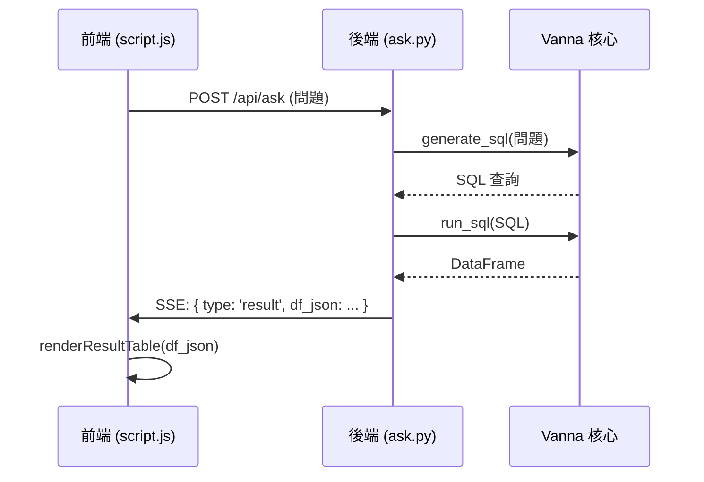
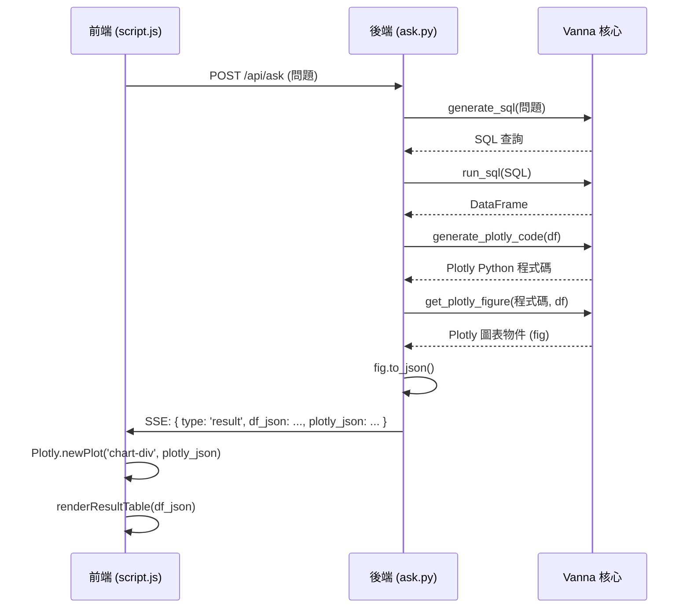

# 視覺化流程重構計畫

## 1. 現況分析

目前的系統在處理使用者提問時，後端會生成並執行 SQL 查詢，然後將查詢結果 (DataFrame) 以 JSON 格式傳送到前端。前端接收到資料後，僅將其渲染成一個靜態的 HTML 表格。

這個流程並未充分利用 Vanna 核心庫中強大的圖表生成能力 (`generate_plotly_code` 和 `get_plotly_figure`)。視覺化的責任完全被忽略了。

## 2. 重構目標

將視覺化生成的責任從前端轉移回後端，以充分利用現有的 `vanna` 圖表生成邏輯。前端將專注於渲染由後端準備好的互動式圖表和資料表格。

## 3. 流程設計

### 3.1 現有流程

### 3.2 計畫流程

## 4. 實施步驟

1.  **修改後端 `app/blueprints/ask.py`**:
    *   在 `run_vanna_in_thread` 函式中，執行 `run_sql` 之後。
    *   新增呼叫 `vn.generate_plotly_code()` 和 `vn.get_plotly_figure()`。
    *   將生成的 Plotly 圖表物件轉換為 JSON (`fig.to_json()`)。
    *   在傳送給前端的 `result` 事件中，加入 `plotly_json` 欄位。

2.  **修改前端 `static/script.js`**:
    *   在 `index.html` 中新增一個用於顯示圖表的 `
` 容器 (例如 `

`)。
    *   在 `ask()` 函式中，當接收到 `result` 事件時，檢查是否存在 `plotly_json`。
    *   如果存在，使用 `Plotly.newPlot('chart-output', JSON.parse(data.plotly_json))` 來渲染圖表。
    *   確保在 `index.html` 中引入 Plotly.js 函式庫。
