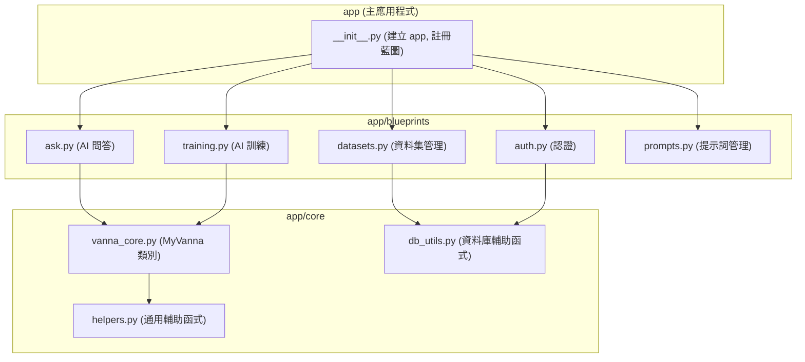

# `app.py` 重構計畫

這份文件旨在分析現有的 `app.py` 檔案，並提出一個清晰的重構計畫，目標是將這個龐大的單體應用程式分解成多個功能內聚、低耦合的模組（藍圖）。

## 1. `app.py` 結構分析

`app.py` 目前包含了以下幾個核心功能區塊，這些區塊緊密地耦合在一起：

### a. 應用程式設定與初始化 (App Setup & Configuration)
- **職責**: 建立 Flask app 物件、載入環境變數、設定金鑰、設定使用者。
- **相關程式碼**: `Flask(__name__)`, `load_dotenv()`, `app.config`, `users` 變數。

### b. 核心輔助函式 (Core Helpers)
- **職責**: 提供跨越多個功能區塊的通用功能，例如資料庫連線、日誌記錄。
- **相關程式碼**: `get_user_db_path()`, `get_user_db_connection()`, `load_prompt_template()`, `write_ask_log()` 等。

### c. 使用者與認證 (Authentication & User Management)
- **職責**: 處理使用者登入、登出、以及透過裝飾器保護路由。
- **相關程式碼**: `/login`, `/logout` 路由，`@api_login_required` 裝飾器。

### d. 資料集管理 (Dataset Management)
- **職責**: 處理資料集的 CRUD（建立、讀取、更新、刪除）、啟用、檔案上傳/刪除等。這是應用程式最複雜的部分之一。
- **相關程式碼**:
    - `/api/datasets` (GET, POST, PUT, DELETE)
    - `/api/datasets/activate`
    - `/api/datasets/<dataset_id>/tables`
    - `/api/datasets/files`

### e. Vanna AI 核心整合 (Vanna AI Core Integration)
- **職責**: 封裝 Vanna.AI 的核心邏輯，包括初始化不同的大語言模型（LLM）、連接向量資料庫、以及覆寫核心方法以加入日誌記錄。
- **相關程式碼**: `MyVanna` 類別，`get_vanna_instance()`，`configure_vanna_for_request()`。

### f. AI 訓練流程 (AI Training Workflow)
- **職責**: 提供 API 端點來訓練 AI 模型，包括處理 DDL、文件和問答配對。
- **相關程式碼**:
    - `/api/training_data`
    - `/api/save_documentation`
    - `/api/add_qa_question`
    - `/api/train`
    - `/api/generate_qa_from_sql`
    - `/api/analyze_schema`

### g. AI 問答流程 (AI Asking Workflow)
- **職責**: 處理使用者提出的自然語言問題，透過 Vanna.AI 生成 SQL、執行查詢並回傳結果與分析。這是最核心的 AI 互動功能。
- **相關程式碼**: `/api/ask` 路由及其背後的複雜執行緒和日誌串流邏輯。

### h. 提示詞管理 (Prompt Management)
- **職責**: 提供 API 來管理系統中使用的各種提示詞（Prompts），包括 CRUD 和重設為預設值。
- **相關程式碼**: `/api/prompts`, `/api/save_prompt`, `/api/delete_prompt`, `/api/reset_prompt_to_default`。

## 2. 核心邏輯：作用中資料集的抓取

在進行分解之前，必須先釐清一個貫穿整個應用程式的核心邏輯：**如何確定當前操作的資料集**。

所有與資料相關的操作（提問、訓練、查看綱要等）都依賴於一個「作用中」的資料集。這個狀態是透過 `session` 來管理的。

- **狀態儲存**: 使用者啟用某個資料集後，其 ID 會被儲存在 `session['active_dataset_id']` 中。
- **邏輯流程**:
    1.  **觸發點**: 使用者透過呼叫 `POST /api/datasets/activate` 並傳入 `dataset_id` 來啟用一個資料集。
    2.  **狀態設定**: 該路由會將傳入的 `dataset_id` 存入 `session['active_dataset_id']`。
    3.  **後續操作**: 之後所有需要與資料互動的路由（例如 `/api/ask`, `/api/train`），都會從 `session` 中讀取 `active_dataset_id`。
    4.  **資料庫查詢**: 取得 `dataset_id` 後，程式會查詢該使用者的元數據資料庫（例如 `training_data_user1.sqlite`），在 `datasets` 表中找到對應的紀錄，從而獲取該資料集實際的資料庫檔案路徑（`db_path`）。
    5.  **Vanna 配置**: 最後，`configure_vanna_for_request` 函式會使用這個 `db_path` 來設定 Vanna 實例的資料庫連線。

這個「從 `session` 獲取 ID -> 查詢元數據庫 -> 獲取實體路徑」的流程是重構時必須在各個藍圖中正確傳遞和使用的關鍵。

## 3. 重構藍圖 (Refactoring Blueprint)

我們將採用 Flask Blueprints 的方式來分解 `app.py`。目標是為每個主要功能區塊建立一個獨立的藍圖。



### 建議的檔案結構

```
/app
|-- __init__.py         # 應用程式工廠，註冊藍圖
|-- config.py           # 應用程式設定
|
|-- blueprints/
|   |-- __init__.py
|   |-- auth.py           # 包含 /login, /logout
|   |-- datasets.py       # 包含所有 /api/datasets/* 路由
|   |-- training.py       # 包含 /api/train, /api/generate_qa, 等
|   |-- ask.py            # 包含 /api/ask
|   |-- prompts.py        # 包含所有 /api/prompts/* 路由
|
|-- core/
|   |-- __init__.py
|   |-- vanna_core.py     # MyVanna 類別和相關輔助函式
|   |-- db_utils.py       # get_user_db_connection, init_training_db 等
|   |-- helpers.py        # load_prompt_template, write_log 等通用函式
|
|-- static/
|-- templates/
|-- run.py                # 應用程式啟動點 (取代 app.py 中的 if __name__ == '__main__')
```

### 分解步驟

1.  **建立 `core` 模組**:
    - 將 `MyVanna` 類別、`get_vanna_instance`、`configure_vanna_for_request` 移至 `app/core/vanna_core.py`。
    - 將 `get_user_db_path`、`get_user_db_connection`、`init_training_db` 等資料庫相關函式移至 `app/core/db_utils.py`。
    - 將其餘的輔助函式移至 `app/core/helpers.py`。

2.  **建立 `blueprints`**:
    - 為上述每個功能區塊（auth, datasets, training, ask, prompts）建立對應的 `.py` 檔案。
    - 將 `app.py` 中對應的路由和邏輯逐一遷移到相應的藍圖檔案中。
    - 在每個藍圖檔案中，從 `app.core` 導入所需的核心功能。

3.  **建立應用程式工廠**:
    - 在 `app/__init__.py` 中建立 `create_app` 函式。
    - 在此函式中，初始化 Flask app，並使用 `app.register_blueprint()` 註冊所有建立的藍圖。

4.  **更新啟動點**:
    - 建立 `run.py`，從 `app` 導入 `create_app` 函式，並在此啟動伺服器。

這個計畫將 `app.py` 的職責明確劃分，使得每個模組都更易於理解、測試和維護。